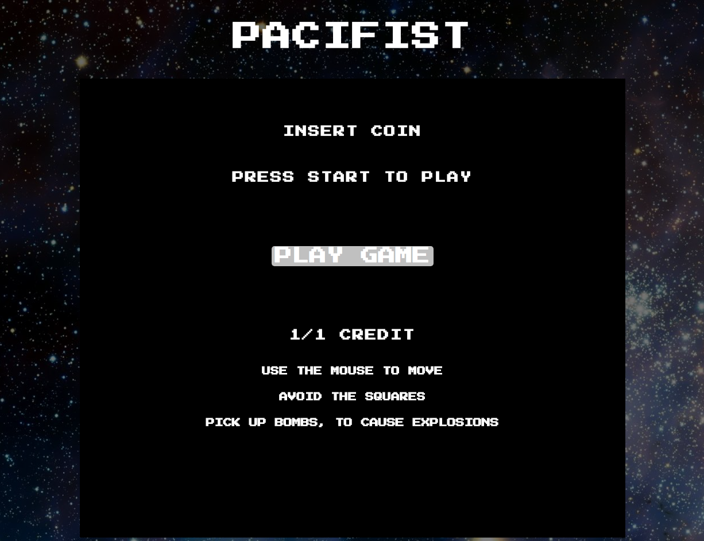
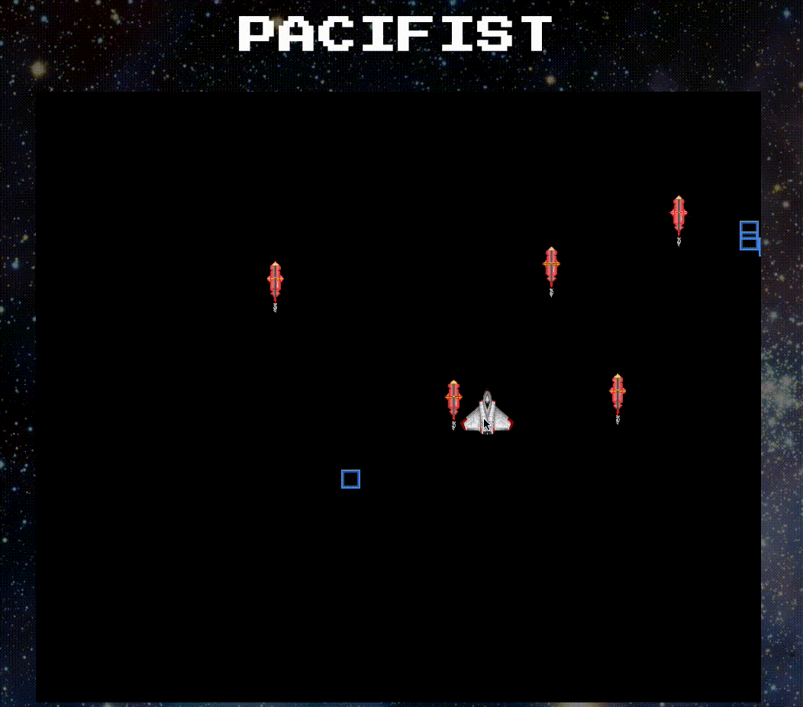

# Pacifist



## Background

[live link][pacifist]
[pacifist]: https://brandontat.github.io/pacifism_clone/

Pacifist is 2D game inspired by Geometry Wars - Pacifism mode. The objective in Geometry Wars is to survive as long as possible and score as many points as possible by destroying enemy ships.

Pacifism mode is played on a rectangular field, where the player controls a ship and its movements using the mouse as input. However unlike the other modes, the player's ship does not have a cannon equipped to destroy enemy ships. Instead the player must navigate through "Gates" in order set off an explosion to destroy enemies. When a player passes through a Gate any enemies within a certain radius of the Gate will be destroyed. Enemies spawn in groups around the four corners of the field. As the player progresses, the amount of enemies spawned will increase, until the player loses. A player will lose if an enemy ship touches their ship.

## Gameplay

The rules of the game are simple. Users control the movement of the ship with the mouse pointer. Simply point your mouse where you want the ship to go. A loss results in being touched by a blue square. Players can destroy blue squares by flying over rockets, thereby causing explosions. Your score is directly correlated to how many enemies you kill.

Gameplay can be seen below.


## Features and implementation

Pacifist is built using JavaScript and jQuery for overall structure and logic, and styled with CSS. Additionally Easel.js and HTML5 Canvas were used for DOM manipulation and rendering.

The Ticker class inside Easel.js was used to give the impression that objects were animated. At every tick, if the game was not over, the position of the mouse would be stored and then used to determine the next position for the Enemy and Ship. Once the positions were updated, each object on the stage would be drawn and then updated. If the game was over, the game would be reset and all objects currently on the board would be cleared.
```JavaScript
beginGame() {
  createjs.Ticker.addEventListener('tick', (event) => {
    if (this.game.over) {
      this.game.reset();
      this.stage.removeAllChildren();
      this.stage.clear();
      return;
    } else {
      let newPosX = this.stage.mouseX;
      let newPosY = this.stage.mouseY;
      let mousePos = [newPosX, newPosY];
      this.game.step(event.delta, mousePos, this.stage);
      this.game.draw(this.stage);
      this.stage.update();
    }
  });
  createjs.Ticker.setFPS(60);
}
```
`event.delta` inside of `this.game.step` allow for animations to be independent of the frame rate. This ensures that the animations run for the same amount of time, even if the device is running slower than the specified frame rate.

### Bomb Explosion

I gave bombs a specific blast radius of about 200px. When a user activates a bomb, I check the distance between the bomb and every enemy currently on the stage. If the distance between the two objects is less than or equal to the blast radius, than I remove the enemy and the bomb from the stage. The code can be seen below.

```JavaScript
removeBlastRadius(bomb, stage) {
  this.enemies.forEach( enemy => {
    if (this.inBlastRadius(bomb.pos, enemy.pos)) {
      this.remove(enemy, stage);
      this.score += 1;
    }
  });
}
```

## Future Directions

### Graphics
I plan to add much more details in terms of visual affects to the project. Such as the ship changing animations or rotating when going in a different direction. Additionally I want to frame the screen with an arcade emulator, giving the impression that you're playing an old school arcade game.

### Game Mode
Implementing different type of game mode, one where you have the ability to shoot a cannon.

### Different Enemies
add a different type of enemy with different moving patterns and speeds.
